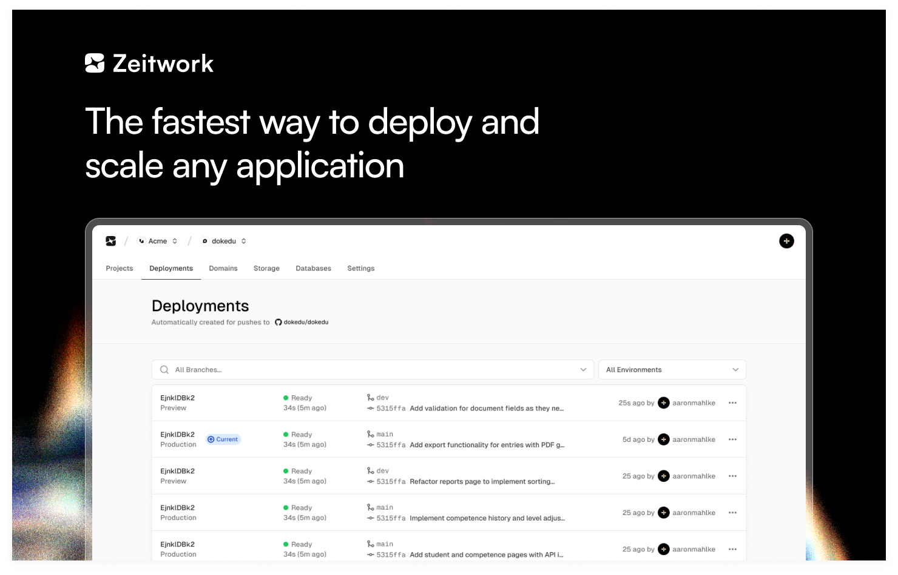

> ⚠️ **Note:** Zeitwork is currently in early-stage development. We welcome feedback and contributions.

# Zeitwork

**The easiest way to deploy any app — just push to Git.**

Zeitwork is an open-source **Platform-as-a-Service** (PaaS) that builds and deploys your applications directly from GitHub. Whether it’s a Node.js app, a Python service, or a full-stack monolith — if it has a `Dockerfile`, we’ll run it. Zero configuration. Fully hosted. No infrastructure headaches.

---

## 🚀 Features

* **One-Command Deploys**
  Push to your main branch and get a live deployment automatically.

* **Zero Config**
  Just connect your repo — no YAML, no pipelines, no surprises.

* **Docker-Native**
  Bring your own `Dockerfile`. We’ll build and run your container as-is.

* **Hosted & Scalable**
  We manage infrastructure, scaling, networking, and health checks.

* **Open Source**
  Transparent by design. Fork it. Self-host it. Extend it.

* **CI/CD by Default**
  Every commit gets built, deployed, and versioned.

---

## 🧠 Why Zeitwork?

Most deployment platforms are either locked down or overengineered. Zeitwork strikes a balance:

* No lock-in: self-host or extend anytime
* No learning curve: no Kubernetes, no Terraform
* No surprises: full transparency via open source

Zeitwork is ideal for:

* **Startups** that need fast iteration without vendor lock-in
* **Developers** who care about clarity and control
* **Teams** building with containers
* **Companies** that may want to self-host later

---

## ⚙️ How It Works

1. **Sign up** at [zeitwork.com](https://zeitwork.com) (Free tier available)
2. **Connect your GitHub repo**
3. **Ensure a valid `Dockerfile`** is present in the root
4. **Push to your main branch**
5. 🎉 Zeitwork builds and deploys your app automatically

---

## 🛠️ Local Development

Zeitwork uses [Bun](https://bun.sh/) as the primary package manager and runtime.

### Prerequisites

* [Bun](https://bun.sh/) — v1.0 or higher
* [Docker](https://www.docker.com/)
* [Node.js](https://nodejs.org/) (for some tooling, optional)

### Clone the Repo

```bash
git clone https://github.com/zeitwork/zeitwork.git
cd zeitwork
```

### Install Dependencies

```bash
bun install
```

> ℹ️ This project uses [Bun workspaces](https://bun.sh/docs/project-management/workspaces). The root handles dependencies for all apps and packages.

### Monorepo Structure

```
.
├── apps/
│   ├── api/             # Bun-based backend API
│   ├── k8s/             # Kubernetes configs (dev/staging/prod)
│   └── web/             # Nuxt-based frontend (default app)
├── packages/
│   └── database/        # Drizzle ORM setup and schema
├── drizzle.config.ts    # DB config
├── docker-compose.yaml  # Local services if needed
└── bun.lockb            # Bun lockfile

```

### Development Scripts

* Run frontend in dev mode:

```bash
bun run web:dev
```

* Run Drizzle CLI:

```bash
bun run db:generate     # Generates SQL migrations
bun run db:migrate      # Runs pending migrations
```

You’ll need to create a `.env.local` file — see `/.env.example`


---

## 🤝 Contributing

Zeitwork is in active development, and we’d love your help.

### Ways to Contribute

* Submit a bug report or feature suggestion via [GitHub Issues](https://github.com/zeitwork/zeitwork/issues)
* Open a pull request to fix a bug or add a feature
* Improve the documentation or examples
* Share feedback on architecture or DX

### Development Guidelines

* Use conventional commits (`feat:`, `fix:`, etc.)
* Follow the established coding style (we use Prettier & ESLint)
* Include tests where applicable
* Keep PRs focused and well-described


## 📄 License

MIT © [Zeitwork Contributors](https://github.com/zeitwork/zeitwork)

---

## 🌐 Get Started

Visit [zeitwork.com](https://zeitwork.com) to deploy your first app — or clone the repo and make it yours.

> 💬 Questions, suggestions, or feedback? [Open an issue](https://github.com/zeitwork/zeitwork/issues) or start a discussion.
