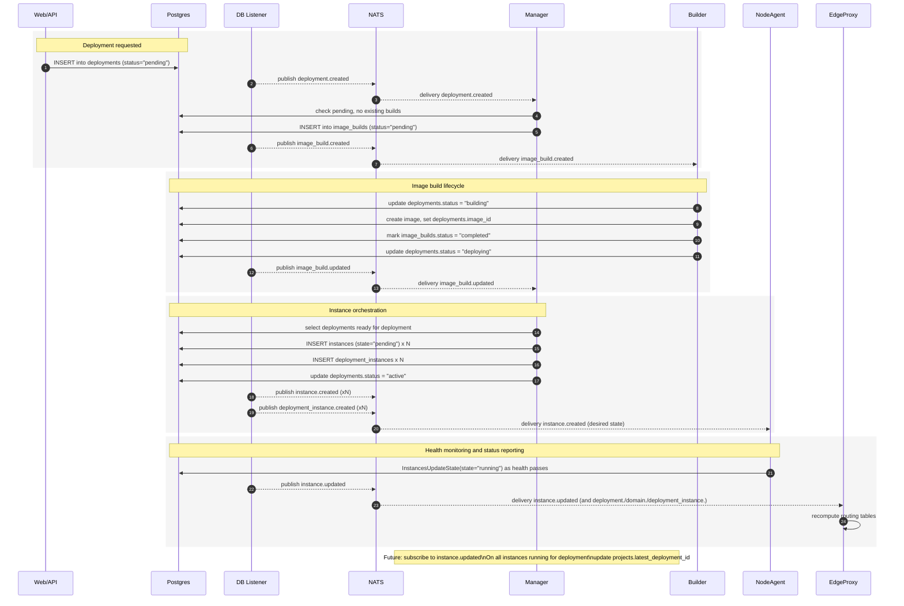

## Event Flow

This diagram models the core deployment event flow across services.

### Notes

- "Healthy" is currently represented by `instances.state = "running"` as reported by NodeAgent health checks.
- Manager subscribes today to `image_build.created`, `image_build.updated`, `deployment.created`, `deployment.updated`.
- Listener publishes DB table changes to NATS: `deployment.*`, `image_build.*`, `instance.*`, `deployment_instance.*`, `domain.*`.
- EdgeProxy listens to `deployment.>`, `instance.>`, `domain.>`, `deployment_instance.>` to update routes.
