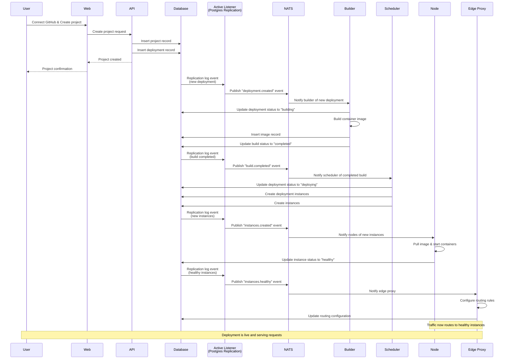

# User Flow - Deployment Process

```mermaid
sequenceDiagram
    participant U as User
    participant W as Web
    participant API as API
    participant DB as Database
    participant AL as Active Listener<br/>(Postgres Replication)
    participant NATS as NATS
    participant B as Builder

    participant S as Scheduler
    participant N as Node
    participant EP as Edge Proxy

    U->>W: Connect GitHub & Create project
    W->>API: Create project request
    API->>DB: Insert project record
    API->>DB: Insert deployment record
    API-->>W: Project created
    W-->>U: Project confirmation

    DB->>AL: Replication log event<br/>(new deployment)
    AL->>NATS: Publish "deployment.created" event

    NATS->>B: Notify builder of new deployment
    B->>DB: Update deployment status to "building"
    B->>B: Build container image
    B->>DB: Insert image record
    B->>DB: Update build status to "completed"

    DB->>AL: Replication log event<br/>(build completed)
    AL->>NATS: Publish "build.completed" event

    NATS->>S: Notify scheduler of completed build
    S->>DB: Update deployment status to "deploying"
    S->>DB: Create deployment instances
    S->>DB: Create instances

    DB->>AL: Replication log event<br/>(new instances)
    AL->>NATS: Publish "instances.created" event

    NATS->>N: Notify nodes of new instances
    N->>N: Pull image & start containers
    N->>DB: Update instance status to "healthy"

    DB->>AL: Replication log event<br/>(healthy instances)
    AL->>NATS: Publish "instances.healthy" event

    NATS->>EP: Notify edge proxy
    EP->>EP: Configure routing rules
    EP->>DB: Update routing configuration

    Note over EP,N: Traffic now routes to healthy instances
    Note over U,EP: Deployment is live and serving requests
```
