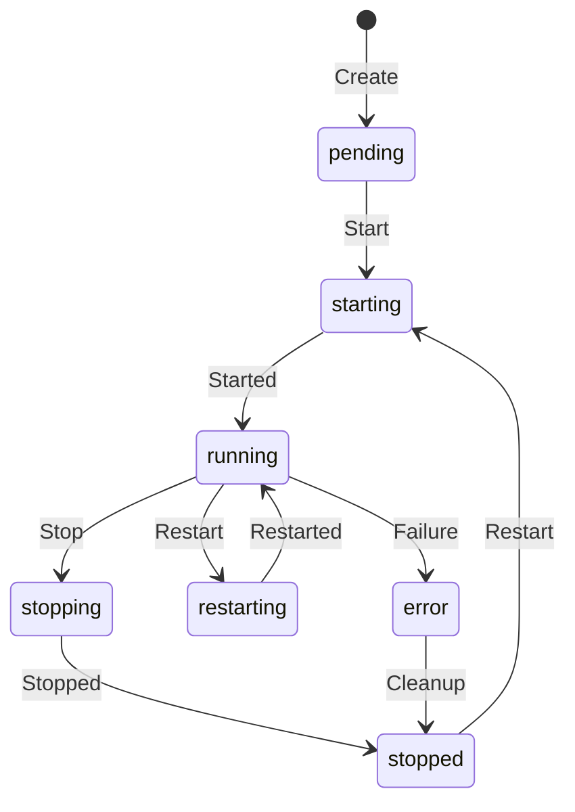

# VM Lifecycle Management

The VM Lifecycle Manager provides comprehensive management of Firecracker virtual machines on worker nodes, including state transitions, health monitoring, resource tracking, and automatic recovery.

## Architecture

```
┌────────────────────────────────────────┐
│            Node Agent                  │
├────────────────────────────────────────┤
│                                        │
│  ┌──────────────────────────────────┐  │
│  │      VM Lifecycle Manager        │  │
│  ├──────────────────────────────────┤  │
│  │  • State Management              │  │
│  │  • Health Monitoring             │  │
│  │  • Resource Tracking             │  │
│  │  • Auto-recovery                 │  │
│  └──────────────────────────────────┘  │
│                ↓                       │
│  ┌──────────────────────────────────┐  │
│  │     Firecracker VMs              │  │
│  │  ┌──────┐  ┌──────┐  ┌──────┐    │  │
│  │  │ VM 1 │  │ VM 2 │  │ VM 3 │    │  │
│  │  └──────┘  └──────┘  └──────┘    │  │
│  └──────────────────────────────────┘  │
└────────────────────────────────────────┘
```

## VM States

The lifecycle manager tracks VMs through these states:



### State Definitions

- **pending**: VM created but not yet started
- **starting**: VM is being launched
- **running**: VM is active and healthy
- **stopping**: VM is being shut down
- **stopped**: VM is shut down cleanly
- **restarting**: VM is being restarted
- **error**: VM encountered an error

## Features

### 1. State Management

Automatic state transitions with safeguards:

```go
// Safe state transitions
vm.State = VMStateStarting  // Only from pending/stopped
vm.State = VMStateRunning   // Only from starting
vm.State = VMStateStopping  // Only from running
vm.State = VMStateStopped   // From stopping/error
```

### 2. Health Monitoring

Continuous health checks every 30 seconds:

- **Process monitoring**: Verify Firecracker process is alive
- **Socket responsiveness**: Check API socket availability
- **Custom health checks**: Application-specific health probes
- **Automatic recovery**: Restart unhealthy VMs

### 3. Resource Tracking

Real-time resource monitoring and allocation:

```yaml
Resource Limits:
  Max VMs: 50 per node
  Max vCPUs: 2x physical cores (overcommit)
  Max Memory: 32GB default

Per-VM Resources:
  CPU Usage: Percentage of allocated vCPUs
  Memory Usage: Actual bytes used
  Network I/O: RX/TX bytes
  Disk I/O: Read/Write bytes
```

### 4. Resource Prediction

Capacity planning with trend analysis:

- Historical tracking (24-hour window)
- Growth rate calculation
- Time-to-exhaustion prediction
- Threshold alerts (80% CPU, 90% memory)

## API Endpoints

The VM manager exposes these endpoints:

### VM Operations

```bash
# Restart a VM
POST /api/v1/vms/{instance_id}/restart
{
  "graceful": true
}

# Get VM health
GET /api/v1/vms/{instance_id}/health

# List all VMs
GET /api/v1/vms

# Get VM metrics
GET /api/v1/vms/metrics
```

### Resource Management

```bash
# Get resource availability
GET /api/v1/resources

# Get resource history
GET /api/v1/resources?history=true&duration=1h
```

## Configuration

VM Manager configuration options:

```go
type VMManagerConfig struct {
    VMDir                 string        // VM files directory
    FirecrackerBin        string        // Firecracker binary path
    KernelPath            string        // Kernel image path
    MaxVMs                int           // Maximum VMs per node
    MaxVCPUs              int           // Maximum total vCPUs
    MaxMemoryMB           int           // Maximum total memory
    HealthCheckInterval   time.Duration // Health check frequency
    ResourceCheckInterval time.Duration // Resource check frequency
}
```

Default values:

- Max VMs: 50
- Max vCPUs: 2x physical cores
- Max Memory: 32GB
- Health Check: Every 30s
- Resource Check: Every 60s

## Lifecycle Hooks

Custom logic at lifecycle events:

```go
vm.OnStart = func(vm *VM) error {
    // Called when VM starts
    notifyOperator(vm.ID, "started")
    return nil
}

vm.OnStop = func(vm *VM) error {
    // Called when VM stops
    cleanupResources(vm.ID)
    return nil
}

vm.OnHealthCheck = func(vm *VM) error {
    // Called during health checks
    updateMetrics(vm.ID, vm.Resources)
    return nil
}
```

## Graceful Shutdown

Two shutdown modes:

### Graceful (default)

1. Send shutdown signal via Firecracker API
2. Wait up to 30 seconds for clean shutdown
3. Force kill if timeout exceeded

### Force

1. Immediately kill Firecracker process
2. Clean up resources
3. Mark as stopped

## Auto-recovery

Automatic recovery mechanisms:

### Stuck State Recovery

- **Starting > 5 minutes**: Mark as error
- **Stopping > 2 minutes**: Force stop
- **Error state**: Attempt cleanup and restart

### Process Death Recovery

- Detect unexpected process termination
- Mark VM as error state
- Trigger alerts
- Optional auto-restart

### Health Failure Recovery

- Track consecutive health check failures
- After 3 failures: Mark unhealthy
- Optional auto-restart based on policy

## Resource Allocation

Hierarchical resource management:

```
Node Total Resources
├── VM 1: 2 vCPUs, 2GB RAM
├── VM 2: 4 vCPUs, 4GB RAM
├── VM 3: 1 vCPU, 1GB RAM
└── Available: 25 vCPUs, 25GB RAM
```

### Allocation Strategy

1. Check available resources
2. Reserve resources atomically
3. Track actual vs allocated usage
4. Release on VM termination

### Overcommit Policy

- CPU: Allow 2x overcommit
- Memory: No overcommit (strict limit)
- Network: Rate limiting per VM
- Disk: Quota per VM

## Monitoring Integration

The VM manager integrates with health monitoring:

```go
// Export metrics to monitoring system
metrics := vm.Resources
healthMonitor.RecordMetrics(
    vm.ID,
    metrics.CPUUsage,
    metrics.MemoryUsage,
    metrics.NetworkRxBytes,
    metrics.NetworkTxBytes,
)
```

## Rate Limiting

Optional per-VM rate limiting:

```go
type RateLimiterConfig struct {
    Bandwidth  int // Mbps
    PacketRate int // packets per second
}

// Apply to VM
vm.Config.RateLimiter = &RateLimiterConfig{
    Bandwidth:  100, // 100 Mbps
    PacketRate: 10000, // 10k pps
}
```

## Troubleshooting

### VM Won't Start

1. Check resource availability: `GET /api/v1/resources`
2. Verify kernel/rootfs paths exist
3. Check Firecracker binary permissions
4. Review VM logs: `/var/lib/zeitwork/vms/{vm_id}/firecracker.log`

### VM Unhealthy

1. Check health status: `GET /api/v1/vms/{id}/health`
2. Review error message in health response
3. Check VM metrics for resource exhaustion
4. Verify network connectivity

### Resource Exhaustion

1. Check current usage: `GET /api/v1/resources`
2. Review historical trends: `GET /api/v1/resources?history=true`
3. Check threshold alerts in logs
4. Consider scaling up node resources

## Performance Tuning

### CPU Templates

Use Firecracker CPU templates for consistency:

- `C3`: Baseline CPU features
- `T2`: Minimal CPU features
- `None`: All host CPU features

### Memory Ballooning

Future enhancement for dynamic memory management

### NUMA Awareness

Pin VMs to NUMA nodes for better performance

## Security Considerations

1. **Process Isolation**: Each VM runs in separate process
2. **Resource Limits**: Enforced CPU/memory limits
3. **Network Isolation**: Separate TAP interfaces per VM
4. **File System**: Separate VM directories with restricted permissions
5. **API Security**: Unix socket with file permissions

## Future Enhancements

- [ ] Live migration support
- [ ] Memory ballooning
- [ ] NUMA pinning
- [ ] GPU passthrough
- [ ] Snapshot/restore
- [ ] Multi-tenancy isolation
