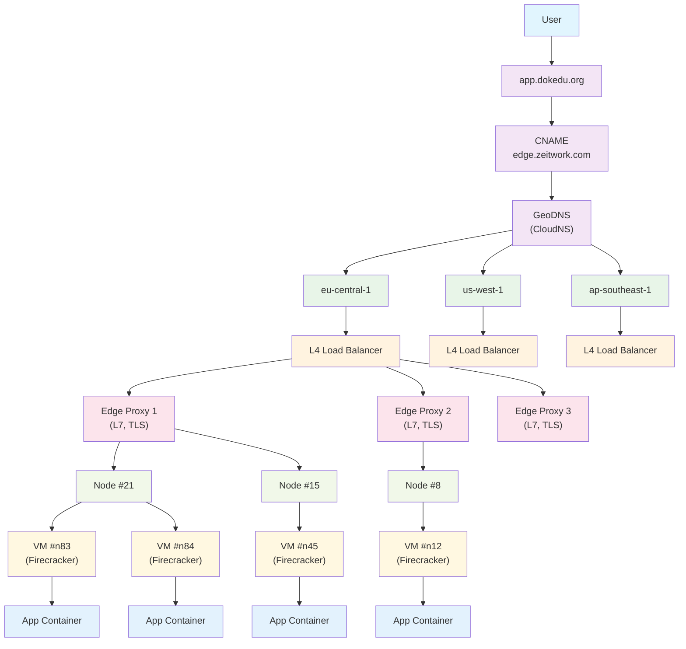
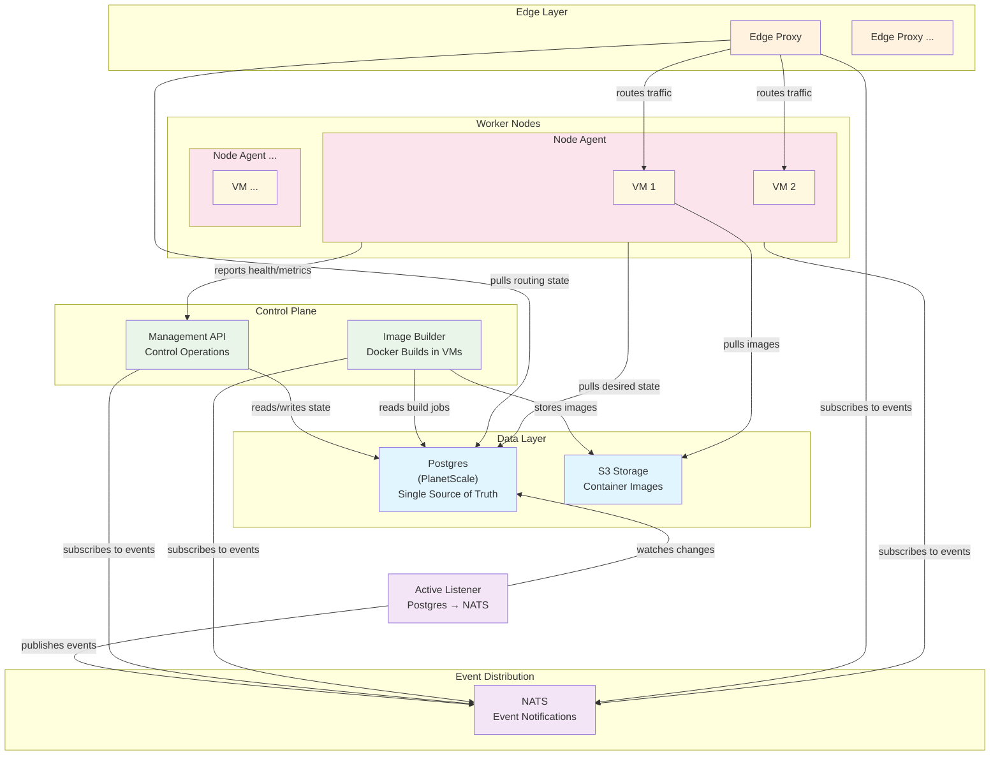

# RFC 0001: Zeitwork Platform v1 Architecture

**Status:** Draft  
**Author:** Zeitwork Team  
**Created:** 2025

## TL;DR

Zeitwork Platform v1 is a distributed, stateless platform for running containerized applications at scale using Firecracker VMs. We're building for high availability with fast failover, using a reconciler pattern with Postgres as our source of truth and NATS for event distribution.

## Background

We're building a Platform-as-a-Service that needs to handle hundreds of nodes and tens of thousands of VM instances. The platform should be production-grade from day one, with emphasis on reliability, scalability, and operational simplicity.

**Important**: This RFC describes the **v1 implementation** of a much larger, long-term vision that isn't fully defined here. The broader goals will introduce additional constraints and requirements that may necessitate significant architectural changes. Many components in this design are considered replaceable with better solutions as we learn and scale. This v1 focuses on getting a solid, working foundation that can evolve.

## Design Goals

- **High Availability**: Fast failover with minimal downtime
- **Stateless Applications**: All deployed apps are horizontally scalable without persistent storage dependencies
- **Operational Simplicity**: Minimal moving parts, clear failure modes
- **Geographic Distribution**: Multi-region support from the start
- **Developer Experience**: Simple `git push` to deploy workflow

## Architecture Overview

### Core Principles

1. **Single Source of Truth**: All state lives in Postgres
2. **Reconciler Pattern**: Services pull desired state and reconcile to it
3. **Event-Driven Updates**: NATS distributes state changes in real-time
4. **Stateless Services**: Everything except Postgres and S3 is stateless
5. **Firecracker Isolation**: Apps run in lightweight VMs for security and resource isolation

### Request Flow

Here's how a typical request flows through the system:

**Flow Summary:**

The edge-proxy maintains a routing table of `domain -> deployments -> vm instances` and load balances across healthy VMs.

## System Components

**Key Interactions:**

- **Postgres**: Single source of truth - all services read state from here
- **NATS**: Notification-only - tells services "something changed, go check Postgres"
- **Active Listener**: Bridges Postgres changes to NATS events
- **All Services**: Pull state from Postgres when they receive NATS notifications

### 1. Database Layer (Postgres + PlanetScale)

**Role**: Single source of truth for all platform state

- **High Availability**: PlanetScale provides built-in HA with automatic failover
- **Contains**: Projects, deployments, nodes, VM instances, domains, routing config, encrypted secrets/keys
- **Access Pattern**: Services pull full state on startup, then subscribe to changes
- **Security**: Secrets and TLS keys stored encrypted in Postgres (no external secret management needed)
- **Trust Model**: Internal services trust each other - no authentication between platform components

### 2. Event Distribution (NATS)

**Role**: Real-time state change propagation

**Why NATS?**

- Excellent multi-region clustering support
- Scales way beyond our current needs
- Battle-tested in production environments
- Low operational overhead

**Usage Pattern**:

- Services subscribe to relevant event streams (granular topics by service/region)
- Multiple Active Listeners for HA (one active, others on standby to prevent duplicate messages)
- **NATS is notification-only**: When services receive a NATS event, they pull fresh state from Postgres
- **No State in NATS**: NATS messages are just "something changed" signals, not the actual data
- Edge proxies update routing tables by pulling from Postgres when notified

**Future**: More granular messaging where only relevant nodes/services subscribe to specific topics

### 3. Active Listener

**Role**: Postgres change stream → NATS events

- Hooks into Postgres replication log
- Publishes structured events to NATS topics
- Examples: VM health changes, deployment updates, routing changes
- **Critical for fast failover**: When a VM goes unhealthy, all edge proxies know within milliseconds

### 4. Edge Proxy (L7)

**Role**: Request routing and TLS termination

- Maintains in-memory routing table: `domain -> healthy VMs`
- **Startup**: Pulls routes in chunks from Postgres (may take time), starts routing once healthy
- Subscribes to NATS for routing updates
- Handles TLS termination (CertMagic for Let's Encrypt automation)
- Load balances across healthy VM instances
- Supports sticky sessions for WebSocket connections

**Implementation**: Envoy or self-written proxy in Go

**Future**: Split regions into zones with edge proxies responsible for specific zones within a region

### 5. Node Agent

**Role**: VM lifecycle management on worker nodes

- Pulls desired state from Postgres on startup
- Subscribes to NATS for instance changes
- Manages Firecracker VM lifecycle (create, start, stop, destroy)
- Reports VM health and metrics back to management API
- **Drift Prevention**: Full state reconciliation every 6 hours

**Responsibilities**:

- VM resource allocation and isolation
- Health monitoring and reporting

### 6. Management API - TODO

**Role**: Control plane for the platform

- REST API for platform operations
- Handles deployment requests, scaling decisions
- Interfaces with image builder for container builds
- Exposes metrics and logs
- **Stateless**: Can run multiple instances behind load balancer

### 7. Image Builder

**Role**: Container image building and storage

- Pulls desired state from Postgres on startup
- Subscribes to NATS for changes
- **Security**: Builds Docker images inside Firecracker VMs for proper isolation and security
- Builds Docker images from GitHub repos
- Stores images in S3-compatible storage using distribution
- Handles build caching and optimization

## Networking & DNS

### Current Approach (v1)

- **GeoDNS**: CloudNS for geographic routing
- **L4 Load Balancer**: External provider with DDoS protection - assumed highly available
- **L7 Proxy**: Our edge-proxy handles application routing

### Future Approach (v2+)

- **Anycast Network**: Own BGP announcements for faster failover
- **Direct Peering**: Reduce latency to major cloud providers

## Deployment Model

### Application Constraints

- **Stateless**: Apps cannot rely on local storage
- **Dockerized**: Must provide a Dockerfile
- **Horizontally Scalable**: Should handle multiple instances gracefully
- **12-Factor**: Following twelve-factor app principles

**Future:** We detect common frameworks and provide a Dockerfile.

### VM Allocation

- **Minimum**: 3 VMs per deployment for redundancy
- **Distribution**: Spread across multiple nodes/AZs when possible
- **Resource Limits**: Each VM gets 2 vCPUs, 2GB RAM (Firecracker enforced)
- **Security**: Firecracker VMs must run with jailer for proper isolation and security
- **Networking**: IPv6 per VM, isolated network (VMs cannot connect to other VMs)
- **Auto-scaling**: Automatically spin up new VMs when load justifies it

### Deployment Process

1. **Build**: Image builder creates container image
2. **Schedule**: Management API decides VM placement
3. **Deploy**: Node agents create and start new VMs
4. **Health Check**: Wait for app health confirmation
5. **Zero-Downtime Switch**: Route traffic to healthy new VMs
6. **Rollback Ready**: Keep old VMs on standby for 30 minutes for fast rollback
7. **Cleanup**: Destroy old VMs after 30-minute window (or immediately if resources needed)

**Rollback**: Allow instant rollback within 30 minutes, afterwards requires new VM spin-up

## Failure Scenarios & Recovery

### VM Failure

1. Node agent detects unhealthy VM
2. Health status updated in Postgres
3. Active Listener publishes change to NATS
4. Edge proxies remove VM from routing table
5. Management API schedules replacement VM

### Node Failure

1. Multiple VMs become unreachable
2. Management API detects node failure
3. Replacement VMs scheduled on healthy nodes

### Edge Proxy Failure

1. L4 load balancer detects failure
2. Traffic routed to healthy edge proxy instances
3. New edge proxy pulls full routing state from Postgres

### Database Failure

- **Assumption**: PlanetScale handles this
- **Fallback**: Services continue with last known state
- **Manual Recovery**: May require operator intervention for extended outages

## Operational Considerations

### Monitoring

- **VM Health**: Continuous health checks via node agents
- **Service Health**: Standard HTTP health endpoints
- **Resource Usage**: CPU, memory, network metrics per VM
- **Platform Metrics**: Request latency, error rates, deployment success rates

### Scaling

- **Horizontal**: Add more nodes to increase capacity
- **Geographic**: Deploy to new regions independently
- **Application**: Automatic scaling based on CPU/memory thresholds

**Future:** Use smart algorithms and machine learning to predict future load.

### State Reconciliation

**Primary Mechanism**: Real-time updates via NATS notifications

- Services receive NATS notification → immediately pull fresh state from Postgres
- This should handle 99.9% of all state changes in real-time

**Safety Net**: Periodic full state sync (1 hour interval, randomized)

- **Purpose**: Catch any missed NATS events or edge cases that cause drift
- **Expectation**: This should rarely find differences - if it does, something is wrong
- **Process**: Compare local state with Postgres, reconcile differences, alert on discrepancies
- **Randomized timing**: Prevents all services syncing simultaneously

**Important**: The periodic sync is purely a safety mechanism. The system is designed to work entirely on NATS notifications. If we're relying on the hourly sync for normal operation, we have a bug to fix.

## Open Topics

1. **Image Storage**: distribution with s3 storage
2. **TLS Certificate Management**: CertMagic for Let's Encrypt automation
3. **Authentication Between Services**: Currently using internal trust model - may need proper service-to-service auth and certificate management for production
4. **Log Aggregation**: Open question - needs further research
5. **Metrics Collection**: Open question - needs further research
6. **Observability**: Comprehensive logging and monitoring strategy TBD

## Security Considerations

- **VM Isolation**: Firecracker provides strong isolation boundaries
- **Network Segmentation**: Each VM gets isolated network namespace (VMs cannot communicate with each other)
- **Internal Trust**: Platform services trust each other - no authentication between internal components
- **Secret Management**: Encrypted secrets stored directly in Postgres
- **Resource Limits**: Apps running out of memory will crash (by design - no swap)
- **DDoS Protection**: Handled at L4 load balancer level

## Why This Architecture?

### Reconciler Pattern Benefits

- **Resilience**: Services self-heal by comparing actual vs desired state
- **Consistency**: Single source of truth prevents split-brain scenarios
- **Debuggability**: Clear state transitions and audit trail
- **Operational Simplicity**: Predictable behavior during failures

### NATS for Event Distribution

- **Performance**: Sub-millisecond message delivery within region
- **Scalability**: Proven at much larger scales than we need
- **Multi-Region**: Built-in clustering and message routing
- **Operational Maturity**: Well-understood failure modes and operations

### Firecracker VMs vs Containers

- **Security**: Better isolation than containers
- **Performance**: Near-native performance with fast startup
- **Resource Control**: Precise CPU/memory allocation
- **Compatibility**: Can run any Linux application

## Conclusion

This architecture prioritizes operational simplicity and reliability over premature optimization. By keeping services stateless and using proven technologies like Postgres and NATS, we can build a platform that's both scalable and maintainable.

The reconciler pattern gives us strong consistency guarantees while the event-driven updates provide the real-time responsiveness needed for production workloads.

---

_This RFC is a living document and will be updated as we learn more during implementation._
